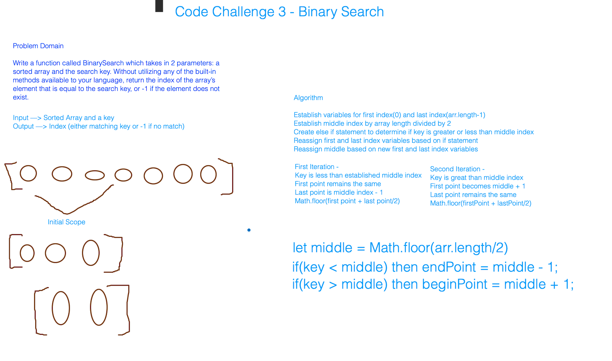

# data-structures-and-algorithms
Code 401 Code Challenges

# Binary Search in a sorted 1D array
* Today, we are going to learn how to find the inde of an array's element that is equal to the search key parameter. 

## Challenge
* Write a function called BinarySearch which takes in 2 parameters: a sorted array and the search key. Without utilizing any of the built-in methods available to your language, return the index of the array’s element that is equal to the search key, or -1 if the element does not exist.

## Approach & Efficiency
*  Beasley and I started by coming to an understanding of how a binary search works. From there, we established a flexible middle point of a sorted array and chose a while loop to iterate through the array. We eventually figured out how to match the key with the index position in the array. 

## Solution

[array-binary-search](array-binary-search.js)

[test](./tests/arrayBinarySearch.test.js)

