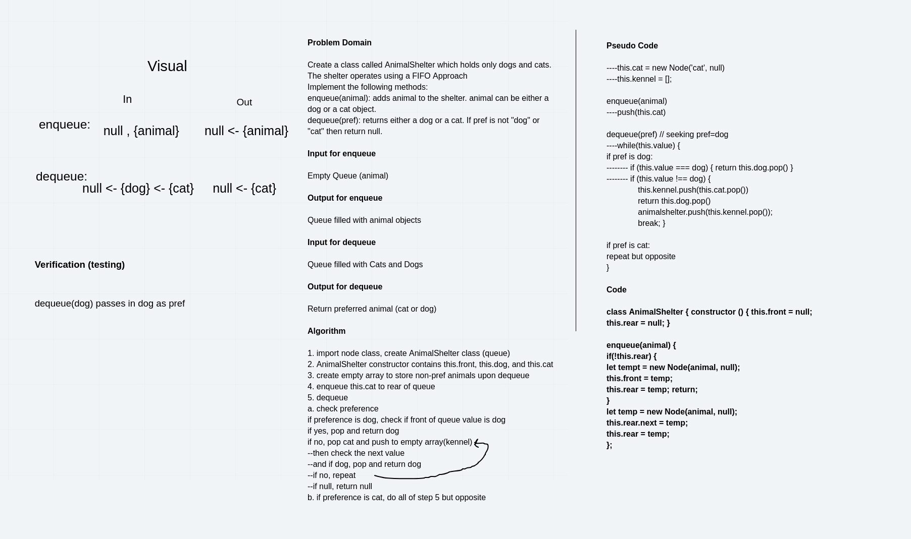

# First In First Out Animal Shelter

* This challenge creates a class called Animal Shelter, operating with a first in, first out method. Use Queue methods (enqueue & dequeue) to add nodes (animals) and remove specific animals (cats or dogs)

## Challenge Features
* Create a class called AnimalShelter which holds only dogs and cats. The shelter operates using a first-in, first-out approach.
* Implement the following methods:
  * enqueue(animal): adds animal to the shelter. animal can be either a dog or a cat object.
  * dequeue(pref): returns either a dog or a cat. If pref is not "dog" or "cat" then return null.

## Testing Requirements
* Can create a class
* Can instantiate an empty stack
* Can successfully pop off a stack
* Can successfully push onto an empty stack
* Can successfully enqueue onto an empty stack

## Approach & Efficiency
* For the **enqueue** method, my partner and I leveraged the constructor and a temp placeholder to successfully push a new value (animal) to an empty queue. 

## FIFO Animal Shelter Links

[Fifo Animal Shelter](fifo-animal-shelter.js)

[Tests](fifo-animal-shelter.test.js)

