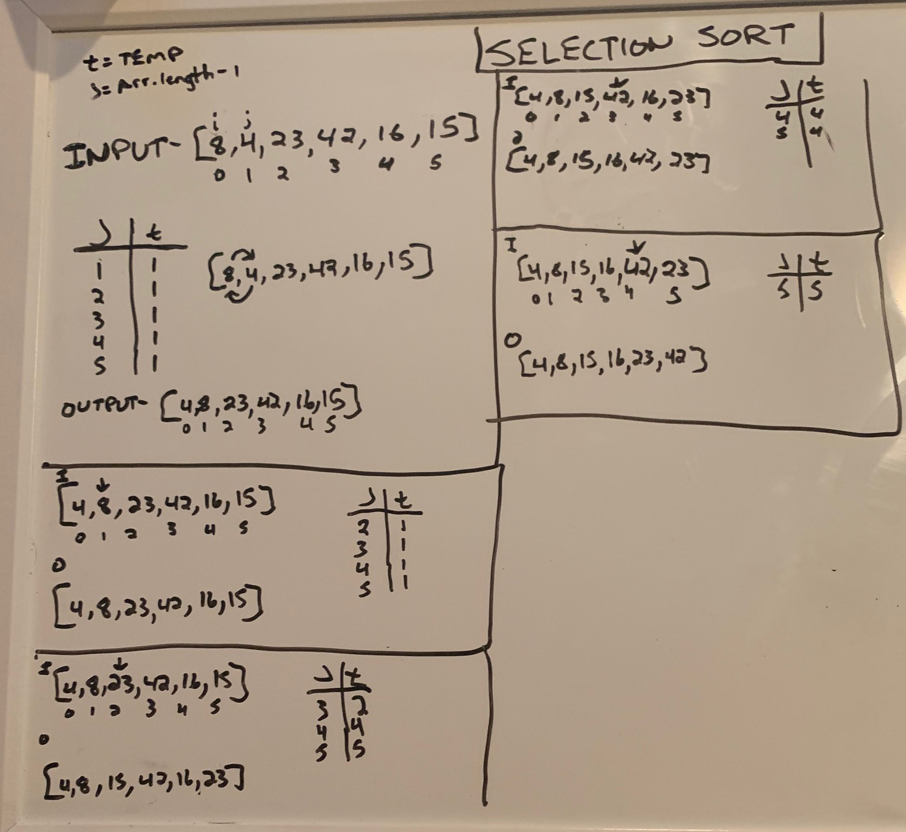

## Selection Sort - A Blog

* Author - Stephen Baldock

Greetings all. Welcome to my first blog post. I'll be publishing new material regularly, so be sure to sign up with your email to receive alerts. 

Today, we're going to break down a **Selection Sort** algorithm. For those of you who aren't familiar, a Selection Sort traverses an array multiple times, slowly building out the desired sequence. 

In the case of today's code challenge, we'll be ordering a non-sorted array by keeping track of the minimum value at each index and placing it in the front of the array. The output will be the same input array ordered incrementally by value. 

Here's the array we'll be working with today.

* Input Array - `[8, 4, 23, 42, 16, 15]`

Okay, who's ready to iterate? Any takers? Crickets....

Our first traversal through the array evaluates whether there is a smaller number than the value currently at index 0, which is 8. We quickly learn that the value at index 1 is 4. We now assign this value to our temp variable, which will hold onto it for us as we traverse the remainder of the array in search of any value less than that of index 1. We do not, and thus the value at our starting point is swapped with the temp value of 4. 

* Updated Array = `[4, 8, 23, 42, 16, 15]`

Our second traversal throught array begins at index 1, since we know that the value at index 0 is smaller. As we move through the array, we find that there are no values in the array smaller than that at index 1. For this iteration, we simply replace the value at index i with the value we stored in the temp variable, which is same value. 

To begin our third traversal, nothing about the order of the array changed, so we can begin our search for a smaller number at index position 2, since we know index 0 and index 1 are ordered correctly. With this third pass, we find that the next smallest value lies at index position 5, which is the final position in the array. We assign our temp variable to hold this value and swap the value with our starting value at index 2.

* Updated Array = `[4, 8, 15, 42, 16, 23]`

Okay, we are halfway through our array and things are looking good. Let's dive back in, beginning at index position 3 this time. Just like our first pass, we find a smaller value upon our first iteration, at index 4. We assign the value to our temp variable, complete our traversal by inspecting the value at index 5, and swap our starting point with the temp value. 

* Update Array = `[4, 8, 15, 16, 42, 23]`

Wow, we are almost there. It looks like we just need to run this baby one more time to get a numerically ordered array! Let's start this thing back up and see what happens. We are now starting at index position 4, with the value of 42. There is only one value to measure, and it happens to be smaller than our starting point. We assign our temp variable, and swap our values. We now have all numbers in the correct positions, but our loop is going to attempt to run one more time to make sure there are no remaining values in the array that we have yet to traverse. 

* Updated Array = `[4, 8, 15, 16, 23, 42]`

On our last attempt, there is nowhere to go. Our temp value is assigned the smallest number, which is our starting value of 42. Since there are no smaller numbers in the array traversal, our temp value is swapped with the smallest number, which is just the same. We've completed our traversal.

Thank you so much for taking this journey with me. If you enjoyed this blog, please subscribe to receive more great content. 

## Pseudocode

 InsertionSort(int[] arr)
  
    FOR i = 1 to arr.length
    
      int j <-- i - 1
      int temp <-- arr[i]
      
      WHILE j >= 0 AND temp < arr[j]
        arr[j + 1] <-- arr[j]
        j <-- j - 1
        
      arr[j + 1] <-- temp

## Attachments

[solution](insertion-sort.js)
[tests](insertion-sort.test.js)
