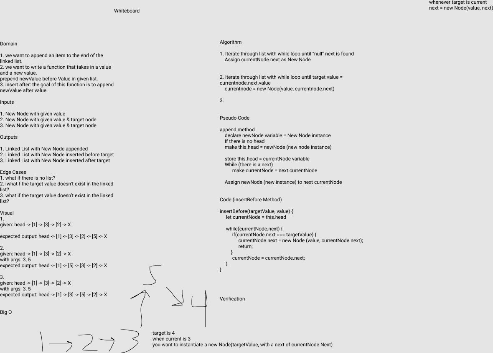
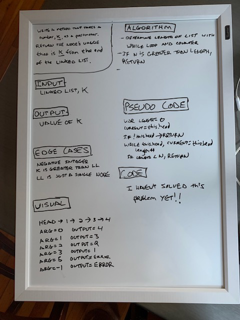
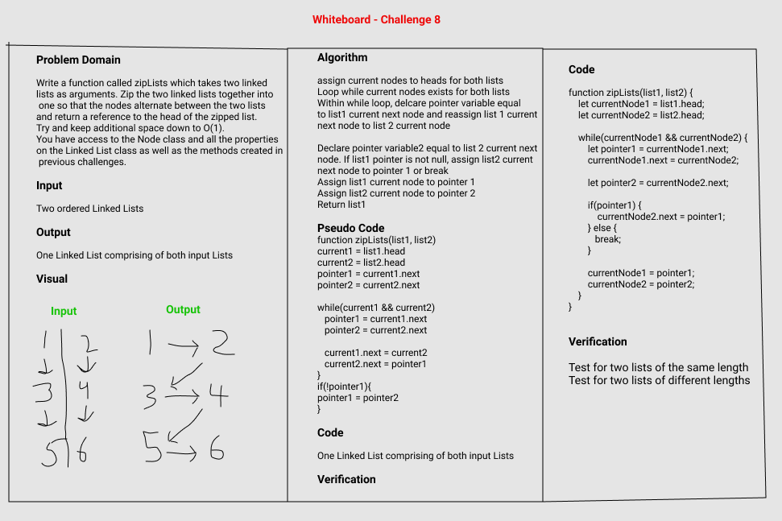

# Singly Linked List
The Singly Linked List

## Challenge #1
* Create a Node class that has properties for the value stored in the Node, and a pointer to the next Node.
* Within your LinkedList class, include a head property. Upon instantiation, an empty Linked List should be created.
* Define a method called insert which takes any value as an argument and adds a new node with that value to the head of the list with an O(1) Time performance.
* Define a method called includes which takes any value as an argument and returns a boolean result depending on whether that value exists as a Node’s value somewhere within the list.
* Define a method called toString (or __str__ in Python) which takes in no arguments and returns a string representing all the values in the Linked List, formatted as:
"{ a } -> { b } -> { c } -> NULL"
* Any exceptions or errors that come from your code should be semantic, capturable errors. For example, rather than a default error thrown by your language, your code should raise/throw a custom, semantic error that describes what went wrong in calling the methods you wrote for this lab.
* Be sure to follow your language/frameworks standard naming conventions (e.g. C# uses PascalCasing for all method and class names).

## Challenge #6

* .append(value) which adds a new node with the given value to the end of the list
* .insertBefore(value, newVal) which add a new node with the given newValue immediately before the first value node
* .insertAfter(value, newVal) which add a new node with the given newValue immediately after the first value node

## Challenge #7

* Write a method for the Linked List class which takes a number, k, as a parameter. Return the node’s value that is k from the end of the linked list. You have access to the Node class and all the properties on the Linked List class as well as the methods created in previous challenges.

## Challenge #8

* Write a function called **zipLists** which takes two linked lists as arguments. Zip the two lists together into one so that the nodes alternate between the two lists and return a reference to the head of the zipped list. Try and keep additional space down to O(1). You have access to the Node class and all the properties on the Linked List class as well as the methods created in previous challenges.

## Approach & Efficiency
I applied the information I gathered through my reading assignments and class demonstration to build ths application. 

## API
* Insert() - Takes a value and adds a new node with the value to the head of the list
* Includes() - Takes a value and returns a boolean result depending on if the value exists as a Node value in the list
* toString() - Returns a string representing all values in the list
* Append() - Takes a value and adds to the end of the Linked List
* insertBefore() - Takes a value and adds it before a target value
* insertAfter() - Takes a value and adds it after a target value

[Linked List](linked-list.js)

;

;