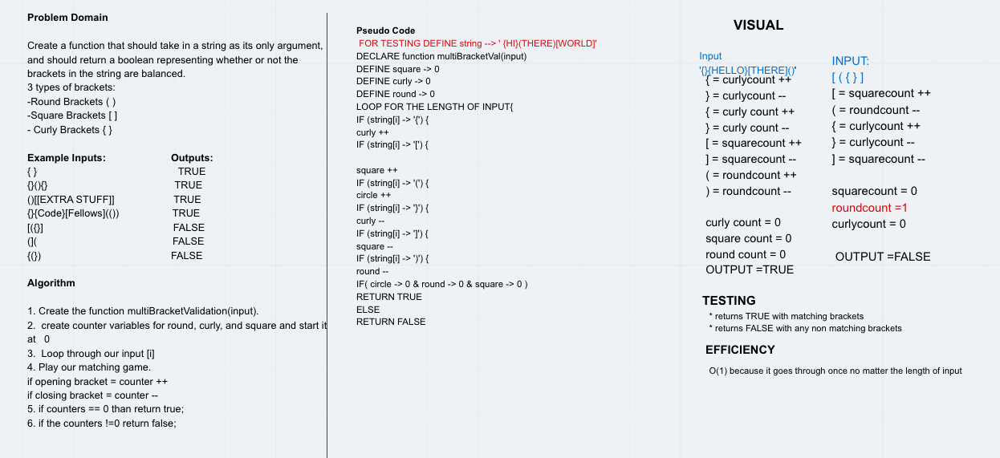

# Multi-Bracket Validation

* This challenge requires building a function that takes in a string and validates whether the brackets in the string are balanced

## Challenge Features
* Your function should take a string as its only argument, and should return a boolean representing whether or not the brackets in the string are balanced. There are 3 types of brackets:

* Round Brackets : ()
* Square Brackets : []
* Curly Brackets : {}

## Testing Requirements
* Test should return true when passed a balanced input
* Test should return false when passed an unbalanced input

## Approach & Efficiency
* Implemented a counter system with each of the three bracket types so that the number would increment when left brackets were counted and decrememnt when right brackets were counted. If the end result is 0, the string is balanced

## Multi-Bracket-Validation Links

[multi-brack-validation](multi-bracket-validation.js)

[Tests](multi-bracket-validation.test.js)

