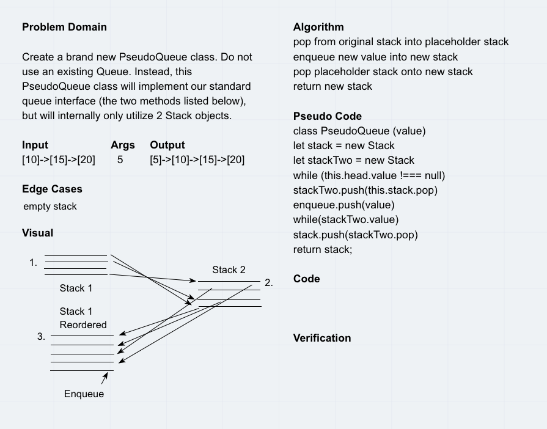

# Queue With Stacks - Code Challenge 11

* This challenge requires the use of Queue methodology to manipulate stacks

## Challenge Features
* Create a brand new PseudoQueue class. Do not use an existing Queue. Instead, this PseudoQueue class will implement our standard queue interface (the two methods listed below), but will internally only utilize 2 Stack objects. Ensure that you create your class with the following methods:

* enqueue(value) which inserts value into the PseudoQueue, using a first-in, first-out approach.
* dequeue() which extracts a value from the PseudoQueue, using a first-in, first-out approach.
* The Stack instances have only push, pop, and peek methods. You should use your own Stack implementation. Instantiate these Stack objects in your PseudoQueue constructor.

## Testing Requirements
* Can create a class
* Can instantiate an empty stack
* Can successfully pop off a stack
* Can successfully push onto an empty stack
* Can successfully enqueue onto an empty stack

## Approach & Efficiency
I approached this challenge by building out testing first to get basic functionality. As I was able to build tests for fundamentals such as empty queues and stacks, I was able to build the methods from there.  

## Queue with Stacks Links

[Queues with Stacks](queue-with-stacks.js)

[Queue with Stacks Tests](queue-with-stacks.test.js)

