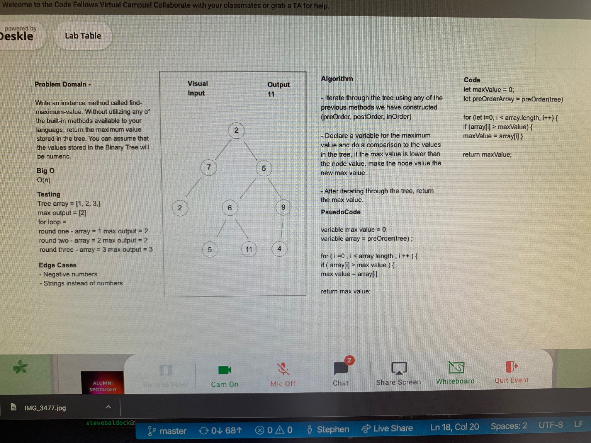

# Trees - Code Challenge 15 & 16

* This challenge requires the use of Queue methodology to manipulate stacks

## Challenge Features
* Create a Node class that has properties for the value stored in the node, the left child node, and the right child node.
* Create a BinaryTree class
* Define a method for each of the depth first traversals called preOrder, inOrder, and postOrder which returns an array of the values, ordered appropriately.
* Any exceptions or errors that come from your code should be semantic, capturable errors. For example, rather than a default error thrown by your language, your code should raise/throw a custom, semantic error that describes what went wrong in calling the methods you wrote for this lab.

* Create a BinarySearchTree class
* Define a method named add that accepts a value, and adds a new node with that value in the correct location in the binary search tree.
* Define a method named contains that accepts a value, and returns a boolean indicating whether or not the value is in the tree at least once.*
* Write an instance method called **find-maximum-value** that returns the maximum value stored in the tree without utilizing any built-in methods available to the language. 

## Testing Requirements
* Can successfully instantiate an empty tree
* Can successfully instantiate a tree with a single root node
* Can successfully add a left child and right child to a single root node
* Can successfully return a collection from a preorder traversal
* Can successfully return a collection from an inorder traversal
* Can successfully return a collection from a postorder traversal
* Can return the maximum value in the tree

## Approach & Efficiency
* Adding a new node in the right place on a Binary Tree is O(n). 

## Trees - Code Challenge 15

[Trees](tree.js)

[Trees Tests](tree.test.js)

## Maximum Value of Binary Tree - Code Challenge 16

[Trees](tree.js)

[Trees Tests](tree.test.js)

